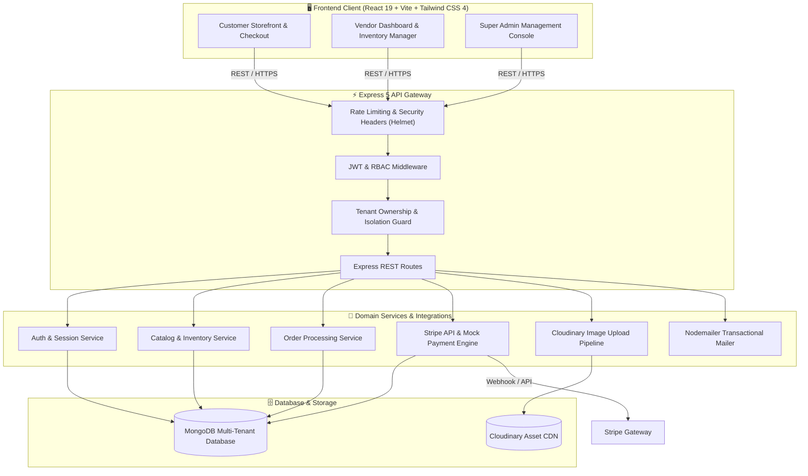

# 🛒 Multi-Tenant E-Commerce SaaS Platform

An enterprise-grade, multi-tenant e-commerce SaaS marketplace built on the MERN stack. The platform enables independent vendors to launch, manage, and scale their own digital storefronts within a unified ecosystem, backed by role-based access control, tenant isolation, Stripe payments, Cloudinary media processing, and interactive business analytics.

[](https://nodejs.org/)
[](https://expressjs.com/)
[](https://react.dev/)
[](https://vitejs.dev/)
[](https://tailwindcss.com/)
[](https://redux-toolkit.js.org/)
[](https://www.mongodb.com/)
[](https://stripe.com/)
[](https://cloudinary.com/)
[](LICENSE)

---

## 📑 Table of Contents

- [Architectural Overview](#-architectural-overview)
- [Key Features](#-key-features)
  - [🛍️ Customer Experience](#️-customer-experience)
  - [🏬 Vendor / Merchant Suite](#-vendor--merchant-suite)
  - [🛡️ Platform Administration](#️-platform-administration)
  - [🔒 Security & Core Architecture](#-security--core-architecture)
- [Tech Stack](#-tech-stack)
- [Prerequisites](#-prerequisites)
- [Installation & Setup](#-installation--setup)
  - [1. Clone Repository](#1-clone-repository)
  - [2. Backend Configuration](#2-backend-configuration)
  - [3. Frontend Configuration](#3-frontend-configuration)
- [Environment Variables](#-environment-variables)
  - [Backend Configuration (`backend/.env`)](#backend-configuration-backendenv)
  - [Frontend Configuration (`frontend/.env`)](#frontend-configuration-frontendenv)
- [Database Seeding & Test Credentials](#-database-seeding--test-credentials)
- [Running the Application](#-running-the-application)
- [Project Structure](#-project-structure)
- [API Reference](#-api-reference)
- [Testing](#-testing)
- [Deployment Guide](#-deployment-guide)
- [Roadmap](#-roadmap)
- [Contributing](#-contributing)
- [License](#-license)

---

## 🏛️ Architectural Overview

The system implements a **shared-database, shared-schema multi-tenant architecture** with strict logical isolation enforced at the service and data access layers. Every merchant store operates as an autonomous tenant with its own products, orders, settings, and analytical reporting while sharing platform infrastructure and customer discovery channels.



---

## 🚀 Key Features

### 🛍️ Customer Experience
- **Cross-Store Discovery**: Browse catalogs from multiple merchant storefronts or explore individual store pages.
- **Dynamic Search & Filtering**: Real-time keyword search, category filters, sorting (price, popularity, rating), and pagination.
- **Rich Product Displays**: Multi-image galleries, inventory availability badges, pricing, and verified customer reviews.
- **Shopping Cart & Wishlist**: Persistent client-side cart synchronization with Redux Toolkit and dedicated customer wishlists.
- **Streamlined Checkout**: Step-by-step address selection, order review, and payment processing.
- **Payment Flexibility**: Seamless Stripe integration supporting both test card flows and offline fallback mock checkout.
- **Order Tracking & Invoices**: Detailed order receipts, shipment status tracking, and purchase history dashboard.
- **Reviews & Ratings**: Interactive 5-star ratings and textual reviews with moderation controls.

### 🏬 Vendor / Merchant Suite
- **Store Customization**: Configurable store profile, logo, banner, description, and contact info.
- **Catalog Management**: Full CRUD operations for product listings, pricing, SKU tags, and category classification.
- **Direct Media Uploads**: Multer + Cloudinary direct upload integration for high-resolution product imagery.
- **Real-Time Inventory Alerts**: Stock level tracking with automated low-stock warnings.
- **Order Lifecycle Fulfillment**: Vendor-scoped order monitoring, packaging, and shipping status transitions (`Pending` -> `Processing` -> `Shipped` -> `Delivered`).
- **Interactive Analytics**: Revenue trends, sales volume, top-performing items, and order volume visualized with **Recharts**.

### 🛡️ Platform Administration
- **Global Governance Dashboard**: High-level platform KPIs including Gross Merchandise Value (GMV), vendor counts, and order statistics.
- **Store & Vendor Moderation**: Review, approve, suspend, or reactivate vendor stores.
- **User Management**: Centralized oversight of customers, merchants, and admin permissions.
- **System Health Monitoring**: Dedicated `/api/health` diagnostics checking database connectivity, process uptime, and memory usage.

### 🔒 Security & Core Architecture
- **Stateless Authentication**: Signed JSON Web Tokens (JWT) with configurable TTL (`7d`) and password hashing via `bcryptjs`.
- **Tenant Isolation Safeguards**: Ownership middleware guaranteeing vendors only read and modify their own store data.
- **API Hardening**: `helmet` security headers, strict CORS origin controls, and request rate-limiting protection.
- **Payload Validation**: Strict request schema validation guarding API entrypoints against injection and malformed inputs.
- **Graceful Fallbacks**: Offline mock payment capability (`PAYMENT_MOCK_MODE=true`) and Ethereal email fallback when SMTP credentials are not supplied.

---

## 🛠️ Tech Stack

| Domain | Technology | Purpose |
|---|---|---|
| **Frontend Framework** | [React 19](https://react.dev/) | Component architecture & modern React compiler support |
| **Build & Tooling** | [Vite 8](https://vitejs.dev/) | Lightning-fast HMR and optimized production bundling |
| **State Management** | [Redux Toolkit 2.12](https://redux-toolkit.js.org/) + React-Redux | Global store for auth, cart, catalog, and wishlist state |
| **Routing** | [React Router DOM 7](https://reactrouter.com/) | Declarative client-side routing with role-based guards |
| **Styling** | [Tailwind CSS 4](https://tailwindcss.com/) | Modern utility-first styling with `@tailwindcss/vite` |
| **Data Visualization** | [Recharts 2.15](https://recharts.org/) | Responsive business metric and revenue charting |
| **HTTP Client** | [Axios 1.16](https://axios-http.com/) | Interceptor-driven HTTP client with automatic auth headers |
| **Backend Runtime** | [Node.js](https://nodejs.org/) (ES Modules) | Asynchronous runtime environment |
| **Web Framework** | [Express 5.2](https://expressjs.com/) | Enterprise RESTful API framework |
| **Database & ODM** | [MongoDB](https://www.mongodb.com/) + [Mongoose 9.6](https://mongoosejs.com/) | Document database with schema modeling and index optimization |
| **Payments** | [Stripe 22.2](https://stripe.com/) | Payment Intents, checkout integration, and webhooks |
| **Cloud Storage** | [Cloudinary 2.10](https://cloudinary.com/) + [Multer 2.1](https://github.com/expressjs/multer) | Cloud image uploading, storage, and transformation |
| **Mailing** | [Nodemailer 8.0](https://nodemailer.com/) | Transactional email delivery with local fallback |
| **Security & Logging** | Helmet, Morgan, Winston, BcryptJS | HTTP header security, access logging, and password hashing |

---

## 📋 Prerequisites

Before setting up the project locally, ensure you have the following installed:

- **Node.js**: `v18.0.0` or higher (Node 20+ LTS recommended)
- **npm**: `v9.0.0` or higher (or Yarn / pnpm)
- **MongoDB**: Local MongoDB instance (`mongodb://localhost:27017`) or a free [MongoDB Atlas](https://www.mongodb.com/atlas) cluster
- **Stripe Account** *(Optional)*: For live payment testing (or use built-in mock mode)
- **Cloudinary Account** *(Optional)*: For production image storage

---

## ⚙️ Installation & Setup

### 1. Clone Repository

```bash
git clone https://github.com/Happybhai329/multi-tenant-ecommerce-saas.git
cd multi-tenant-ecommerce-saas
```

### 2. Backend Configuration

```bash
# Navigate to backend directory
cd backend

# Install dependencies
npm install

# Copy environment template
cp .env.example .env

# Review and edit your .env configuration
# (See Environment Variables section below)
```

### 3. Frontend Configuration

```bash
# Navigate to frontend directory
cd ../frontend

# Install dependencies
npm install

# Copy environment template
cp .env.example .env
```

---

## 🔧 Environment Variables

### Backend Configuration (`backend/.env`)

Create a `.env` file in the `backend/` directory:

```env
# --- APPLICATION SETTINGS ---
NODE_ENV=development
PORT=5000
APP_VERSION=1.0.0

# --- DATABASE CONFIGURATION ---
# Local MongoDB or MongoDB Atlas URI
MONGO_URI=mongodb://localhost:27017/multi_tenant_ecommerce

# --- SECURITY & AUTHENTICATION ---
# Replace with a secure random key (at least 32 characters in production)
JWT_SECRET=super_secret_jwt_key_multi_tenant_saas_ecommerce_2026
JWT_EXPIRE=7d

# --- CORS SETTINGS ---
# Comma-separated list of allowed origins (no trailing slashes)
CLIENT_URLS=http://localhost:5173

# --- STRIPE PAYMENT INTEGRATION ---
STRIPE_SECRET_KEY=sk_test_placeholder_key
STRIPE_PUBLISHABLE_KEY=pk_test_placeholder_key
STRIPE_WEBHOOK_SECRET=whsec_placeholder_key
# Set to 'true' to allow checkout simulation without contacting Stripe servers
PAYMENT_MOCK_MODE=true

# --- CLOUDINARY MEDIA STORAGE ---
CLOUDINARY_CLOUD_NAME=your_cloud_name
CLOUDINARY_API_KEY=your_api_key
CLOUDINARY_API_SECRET=your_api_secret

# --- EMAIL (SMTP) CONFIGURATION (Optional: falls back to Ethereal) ---
SMTP_HOST=
SMTP_PORT=587
SMTP_USER=
SMTP_PASS=
FROM_EMAIL="Multi-Tenant Ecom <noreply@example.com>"
```

### Frontend Configuration (`frontend/.env`)

Create a `.env` file in the `frontend/` directory:

```env
# Base API URL (defaults to /api for Vite proxy routing during local development)
VITE_API_BASE_URL=/api
```

---

## 🗄️ Database Seeding & Test Credentials

The project includes an automated database seeder that configures tenant stores, mock inventory, customer accounts, and demo orders.

To seed your database:

```bash
cd backend
npm run db:seed
```

> [!TIP]
> To wipe the database and re-seed from scratch, run:
> ```bash
> npm run db:reset
> npm run db:seed
> ```

### 🔑 Pre-Configured Test Accounts

All demo accounts share the password: **`Password123!`**

| Role | Email | Access Scope | Sample Data |
|---|---|---|---|
| **Admin** | `admin@test.com` | Full Platform Oversight | Store approvals, user roles, system metrics |
| **Vendor 1** | `vendor1@test.com` | Merchant Store #1 | Tech & Gadgets store, 6 products, pending orders |
| **Vendor 2** | `vendor2@test.com` | Merchant Store #2 | Apparel & Lifestyle store, 6 products, orders |
| **Customer 1** | `customer1@test.com` | Public Storefront | Active cart, wishlist, previous order history |
| **Customer 2** | `customer2@test.com` | Public Storefront | Product reviews, saved addresses |

---

## 🏃 Running the Application

### Option A: Running Backend & Frontend in Parallel

Open two terminal sessions:

#### Terminal 1: Backend Server
```bash
cd backend
npm run dev
# Server boots at http://localhost:5000
```

#### Terminal 2: Frontend Client
```bash
cd frontend
npm run dev
# Client runs at http://localhost:5173
```

Now open your browser and navigate to: **`http://localhost:5173`**

### Available Scripts

#### Backend (`backend/package.json`)
| Command | Description |
|---|---|
| `npm run dev` | Starts API with `nodemon` hot reloading on port 5000 |
| `npm start` | Boots standard Node.js production server |
| `npm test` | Executes store isolation and tenant segregation tests |
| `npm run smoke-test` | Runs comprehensive API endpoint smoke test suite |
| `npm run db:seed` | Populates database with demo users, stores, and products |
| `npm run db:reset` | Flushes collections and resets MongoDB state |

#### Frontend (`frontend/package.json`)
| Command | Description |
|---|---|
| `npm run dev` | Launches Vite local development server |
| `npm run build` | Compiles production assets into `dist/` |
| `npm run preview` | Serves production build locally for verification |
| `npm run lint` | Runs ESLint 10 checks across JSX and JS files |

---

## 📂 Project Structure

```
multi-tenant-ecommerce-saas/
├── backend/
│   ├── src/
│   │   ├── config/
│   │   │   ├── cloudinary.js          # Cloudinary SDK credentials & storage
│   │   │   ├── db.js                  # MongoDB Mongoose connection
│   │   │   ├── env.js                 # Environment variable schema validation
│   │   │   └── stripe.js              # Stripe SDK client initialization
│   │   ├── controllers/
│   │   │   ├── adminController.js     # Platform administration & moderation
│   │   │   ├── analyticsController.js # Aggregated sales & merchant analytics
│   │   │   ├── orderController.js     # Order placement, status & fulfillment
│   │   │   ├── paymentController.js   # Stripe payment intents & mock payment
│   │   │   ├── productController.js   # Catalog CRUD, filters & stock management
│   │   │   ├── reviewController.js    # Product reviews and rating calculations
│   │   │   ├── storeController.js     # Merchant store profile & configuration
│   │   │   ├── uploadController.js    # Cloudinary asset upload handler
│   │   │   ├── webhookController.js   # Stripe event webhook listener
│   │   │   └── wishlistController.js  # Customer wishlist operations
│   │   ├── middleware/
│   │   │   ├── auth.js                # JWT validation & role verification
│   │   │   ├── errorHandler.js        # Global error formatter & HTTP codes
│   │   │   ├── ownership.js           # Multi-tenant resource ownership guard
│   │   │   ├── rateLimiter.js         # Express rate limiter configuration
│   │   │   ├── requestLogger.js       # Morgan & custom request telemetry
│   │   │   └── validate.js            # Input sanitization and payload validation
│   │   ├── models/
│   │   │   ├── Order.js               # Multi-item order schema & snapshots
│   │   │   ├── Payment.js             # Transaction audit schema
│   │   │   ├── Product.js             # Catalog item, SKU & inventory schema
│   │   │   ├── Review.js              # Customer rating and feedback schema
│   │   │   ├── Store.js               # Tenant store profile & branding schema
│   │   │   ├── User.js                # User identity, password hash & roles
│   │   │   └── Wishlist.js            # Customer saved items schema
│   │   ├── routes/                    # RESTful endpoint definitions
│   │   │   ├── adminRoutes.js         # /api/admin
│   │   │   ├── analyticsRoutes.js     # /api/analytics
│   │   │   ├── authRoutes.js          # /api/auth
│   │   │   ├── healthRoutes.js        # /api/health
│   │   │   ├── orderRoutes.js         # /api/orders
│   │   │   ├── paymentRoutes.js       # /api/payments
│   │   │   ├── productRoutes.js       # /api/products
│   │   │   ├── reviewRoutes.js        # /api/reviews
│   │   │   ├── storeRoutes.js         # /api/stores
│   │   │   ├── uploadRoutes.js        # /api/upload
│   │   │   └── wishlistRoutes.js      # /api/wishlist
│   │   ├── utils/
│   │   │   ├── emailService.js        # Nodemailer dispatcher
│   │   │   ├── generateToken.js       # JWT generation utility
│   │   │   ├── logger.js              # Structured logging utility
│   │   │   └── upload.js              # Multer memory storage configuration
│   │   ├── app.js                     # Express app setup, middleware & routes
│   │   └── server.js                  # Entry point & port binding
│   ├── tests/
│   │   ├── smoke.test.js              # API smoke test suite
│   │   └── store.test.js              # Tenant isolation validation suite
│   ├── .env.example                   # Backend environment template
│   ├── package.json                   # Backend dependencies and scripts
│   ├── reset-db.js                    # Database clearing tool
│   └── seed.js                        # Demo dataset seeder
├── frontend/
│   ├── public/
│   │   └── favicon.svg                # Application branding icon
│   ├── src/
│   │   ├── api/                       # Modular Axios API services
│   │   │   ├── adminApi.js
│   │   │   ├── analyticsApi.js
│   │   │   ├── axios.js               # Interceptor client with token injection
│   │   │   ├── orderApi.js
│   │   │   ├── paymentApi.js
│   │   │   ├── productApi.js
│   │   │   ├── storeApi.js
│   │   │   ├── uploadApi.js
│   │   │   └── wishlistApi.js
│   │   ├── app/
│   │   │   └── store.js               # Redux Toolkit centralized store
│   │   ├── components/
│   │   │   ├── admin/                 # Admin sidebar & header layout
│   │   │   ├── cart/                  # Cart items and price calculations
│   │   │   ├── search/                # Search bar, filters, sorter, pagination
│   │   │   ├── storefront/            # Reviews, rating stars, store banners
│   │   │   ├── vendor/                # Charts, metric cards, image uploaders
│   │   │   ├── Navbar.jsx             # Universal responsive navigation bar
│   │   │   ├── ProtectedRoute.jsx     # Role-aware route security wrapper
│   │   │   └── ToastContext.jsx       # Alert and notification toast provider
│   │   ├── features/                  # Redux slices
│   │   │   ├── auth/authSlice.js      # Login, registration, token state
│   │   │   ├── cart/cartSlice.js      # Items, quantities, tax calculations
│   │   │   ├── products/productSlice.js # Catalog browsing & filters
│   │   │   └── wishlist/wishlistSlice.js # Customer wishlist synchronization
│   │   ├── pages/
│   │   │   ├── admin/                 # AdminStores, AdminUsers, AdminVendors
│   │   │   ├── cart/                  # CartPage, CheckoutPage
│   │   │   ├── orders/                # OrdersPage, OrderDetailPage, PaymentPage
│   │   │   ├── storefront/            # Home, StoreListPage, ProductDetailPage
│   │   │   ├── vendor/                # VendorDashboard, Inventory, Orders, Settings
│   │   │   ├── AdminDashboard.jsx     # High-level admin console
│   │   │   ├── Login.jsx              # Universal authentication page
│   │   │   └── Register.jsx           # Customer & Merchant registration
│   │   ├── router/
│   │   │   └── AppRouter.jsx          # Route definitions & permissions
│   │   ├── App.jsx                    # Root application component
│   │   ├── index.css                  # Tailwind CSS imports & base styles
│   │   └── main.jsx                   # React 19 DOM mount
│   ├── .env.example                   # Frontend environment template
│   ├── eslint.config.js               # ESLint 10 configuration
│   ├── package.json                   # Frontend dependencies and scripts
│   ├── vercel.json                    # Vercel SPA routing configuration
│   └── vite.config.js                 # Vite build settings & API proxy
├── docs/                              # Technical architecture and guides
│   ├── API_DOCUMENTATION.md           # Full endpoint specifications
│   ├── ARCHITECTURE.md                # System topology and tenant isolation
│   ├── DEMO_SCRIPT.md                 # Guided presentation walkthrough
│   ├── ENVIRONMENT_SETUP.md           # Step-by-step production setup
│   ├── HANDOFF_NOTES.md               # Maintenance considerations
│   └── PROJECT_SUMMARY.md             # Functional and technical summary
├── CONTRIBUTING.md                    # Contribution guidelines
└── README.md                          # Repository documentation
```

---

## 🌐 API Reference

All backend endpoints are prefixed with `/api`. For complete request and response schemas, refer to [`docs/API_DOCUMENTATION.md`](docs/API_DOCUMENTATION.md).

### Authentication (`/api/auth`)
| Method | Endpoint | Access | Description |
|---|---|---|---|
| `POST` | `/api/auth/register` | Public | Register new customer or merchant account |
| `POST` | `/api/auth/login` | Public | Authenticate user and receive JWT |
| `GET` | `/api/auth/me` | Authenticated | Retrieve current authenticated user profile |
| `POST` | `/api/auth/logout` | Authenticated | Invalidate authentication session |

### Stores & Tenants (`/api/stores`)
| Method | Endpoint | Access | Description |
|---|---|---|---|
| `GET` | `/api/stores` | Public | List all approved and active stores |
| `GET` | `/api/stores/:id` | Public | Get store profile and catalog metadata |
| `POST` | `/api/stores` | Vendor | Create initial store profile for tenant |
| `PUT` | `/api/stores/:id` | Vendor / Admin | Update store details (guarded by ownership) |

### Products (`/api/products`)
| Method | Endpoint | Access | Description |
|---|---|---|---|
| `GET` | `/api/products` | Public | Search and filter products with pagination |
| `GET` | `/api/products/:id` | Public | Fetch product details, stock, and reviews |
| `POST` | `/api/products` | Vendor | Add new product to authenticated vendor's store |
| `PUT` | `/api/products/:id` | Vendor | Update product pricing, details, or stock |
| `DELETE`| `/api/products/:id` | Vendor / Admin | Soft delete / remove product listing |

### Orders & Checkout (`/api/orders`, `/api/payments`)
| Method | Endpoint | Access | Description |
|---|---|---|---|
| `POST` | `/api/orders` | Customer | Create order and reserve product inventory |
| `GET` | `/api/orders/my-orders` | Customer | Retrieve customer order history |
| `GET` | `/api/orders/vendor` | Vendor | View orders containing vendor's store items |
| `PATCH`| `/api/orders/:id/status`| Vendor / Admin | Transition order fulfillment status |
| `POST` | `/api/payments/create-intent` | Customer | Initialize Stripe Payment Intent |
| `POST` | `/api/payments/mock-checkout` | Customer | Instant offline checkout (when mock mode enabled) |

### Administration & Analytics (`/api/admin`, `/api/analytics`)
| Method | Endpoint | Access | Description |
|---|---|---|---|
| `GET` | `/api/admin/metrics` | Admin | Get platform-wide GMV, users, and orders |
| `PATCH`| `/api/admin/stores/:id/status` | Admin | Approve, suspend, or reactivate store |
| `GET` | `/api/analytics/vendor` | Vendor | Retrieve vendor sales velocity and revenue charts |
| `GET` | `/api/health` | Public | Server uptime, memory, and database status check |

---

## 🧪 Testing

The repository features comprehensive automated test suites covering API functionality and tenant boundary validation:

```bash
cd backend

# Execute tenant boundary & store isolation tests
npm test

# Execute end-to-end endpoint smoke tests
npm run smoke-test
```

### Verified Test Cases:
- **Tenant Isolation**: Confirms Vendor A cannot edit, update, or delete products belonging to Vendor B.
- **Role Enforcement**: Prevents regular customers from accessing vendor inventory tools or admin consoles.
- **Order Protection**: Ensures customers can only inspect their own receipts and order histories.
- **Stock Decrementation**: Verifies inventory quantity decrements atomically upon completed checkout.

---

## 🚀 Deployment Guide

### Backend Deployment (Render / Railway / Heroku)

1. Push your repository to GitHub.
2. Create a new **Web Service** on [Render](https://render.com/).
3. Connect the repository and configure settings:
   - **Root Directory**: `backend`
   - **Build Command**: `npm install`
   - **Start Command**: `npm start`
4. Add all environment variables from `backend/.env.example` in the **Environment** tab.
5. Ensure `CLIENT_URLS` includes your deployed frontend URL.

### Frontend Deployment (Vercel)

1. Import the repository on [Vercel](https://vercel.com/).
2. Set **Root Directory** to `frontend`.
3. Framework Preset will automatically detect **Vite**.
4. Configure Environment Variables:
   - `VITE_API_BASE_URL`: `https://your-backend-service.onrender.com/api`
5. Deploy. The repository includes [`frontend/vercel.json`](frontend/vercel.json) to handle Single Page Application (SPA) client-side rewrites automatically.

---

## 🗺️ Roadmap

- [ ] **Real-Time WebSockets**: Live order notifications for vendors and instant delivery tracking for customers.
- [ ] **Advanced ElasticSearch**: Typo-tolerant multi-attribute search and faceted filtering.
- [ ] **Merchant Subscription Tiers**: Tiered vendor commission models and monthly platform subscriptions.
- [ ] **AI Recommendation Engine**: Personalized product recommendations based on browsing history and cart contents.
- [ ] **Mobile App**: Native iOS and Android application built with React Native.
- [ ] **Multi-Currency & Localization**: Geolocation-based currency conversion and multi-language support.

---

## 🤝 Contributing

Contributions are welcome! Please follow these steps to contribute:

1. **Fork the Repository**
2. **Create a Feature Branch**:
   ```bash
   git checkout -b feature/amazing-feature
   ```
3. **Commit your Changes**:
   ```bash
   git commit -m "feat: add amazing feature"
   ```
4. **Push to Branch**:
   ```bash
   git push origin feature/amazing-feature
   ```
5. **Open a Pull Request**

Please read [`CONTRIBUTING.md`](CONTRIBUTING.md) for detailed coding standards and pull request workflows.

---

## 📄 License

This project is licensed under the **ISC License**. See the [LICENSE](LICENSE) file for full details.

---

## 👤 Author

Developed and maintained by **[Happybhai329](https://github.com/Happybhai329)**.

*Feel free to star ⭐ the repository if you found this project helpful!*
